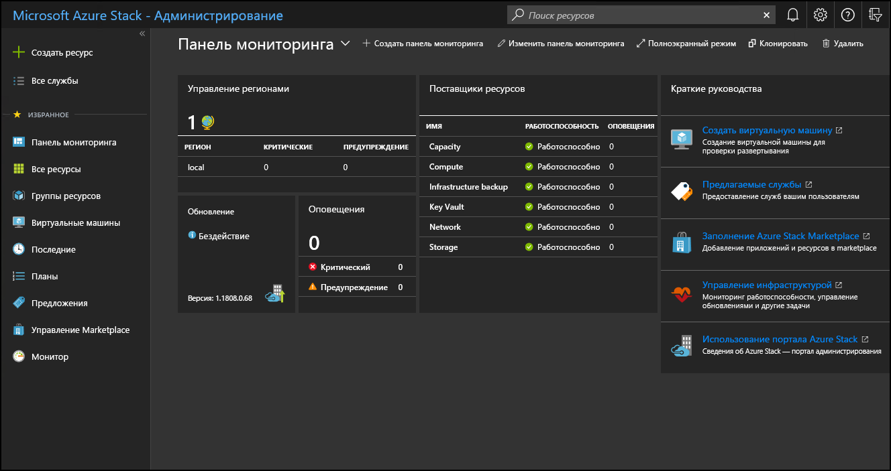

# Использование портала администрирования в Azure Stack Hub

В Azure Stack Hub доступны два портала: портал администрирования и пользовательский портал. Оператор Azure Stack Hub использует портал администрирования для повседневного управления и эксплуатации Azure Stack Hub.

## Доступ к порталу администрирования

Чтобы открыть портал администрирования, введите URL-адрес портала в адресную строку браузера и войдите с учетными данными оператора Azure Stack Hub. В интегрированной системе URL-адрес портала зависит от названия региона и внешнего полного доменного имени (FQDN) для конкретного развертывания Azure Stack Hub. URL-адрес портала администрирования для развертываний Пакета средств разработки Azure Stack (ASDK) всегда остается неизменным.

| Среда | URL-адрес портала администрирования |   
| -- | -- | 
| ASDK| https://adminportal.local.azurestack.external  |
| Интегрированные системы | https://adminportal.&lt;*регион*&gt;.&lt;*полное доменное имя*&gt; | 
| | |

> [!TIP]
> В среде ASDK важно обеспечить [подключение к пакету ASDK](../asdk/asdk-connect.md) по подключению к удаленному рабочему столу или через виртуальную частную сеть (VPN).

 

Для всех развертываний Azure Stack Hub по умолчанию устанавливается часовой пояс UTC.

На портале администрирования можно выполнять следующие операции:

* [Регистрация Azure Stack Hub в Azure](azure-stack-registration.md)
* [Скачивание элементов Marketplace из Azure в Azure Stack](azure-stack-download-azure-marketplace-item.md)
* [Обзор планов, предложений, квот и подписок ](service-plan-offer-subscription-overview.md)
* [Мониторинг работоспособности и оповещений](azure-stack-monitor-health.md)
* [Управление обновлениями Azure Stack Hub](azure-stack-updates.md)

Плитка **Краткое руководство** предоставляет ссылки на электронные документы с описанием распространенных задач.

Оператор может создавать ресурсы, например виртуальные машины, виртуальные сети и учетные записи хранения, непосредственно на портале администрирования, но для создания и тестирования ресурсов следует [войти на портал пользователя](../user/azure-stack-use-portal.md).

>[!NOTE]
>Перейдя по ссылке **Создать виртуальную машину** в кратком руководстве, вы сможете создать виртуальную машину прямо на портале администратора. Но это можно сделать только для проверки правильного развертывания Azure Stack Hub.

## Общие сведения о поведении подписки

Существуют три типа подписки, которые создаются на портале администрирования по умолчанию (потребление, поставщик по умолчанию, измерение). Обычно оператору чаще всего нужна *подписка поставщика по умолчанию*. Вы не можете добавлять другие подписки и использовать их на портале администрирования.

На основе планов и предложений, которые были для них созданы, пользователи создают другие подписки на пользовательском портале. Однако портал пользователя не предоставляет доступ к административным и функциональным возможностям, доступным на портале администрирования.

Портал администрирования и портал пользователя размещаются в разных экземплярах Azure Resource Manager. Такое разделение в Azure Resource Manager означает, что каждый портал использует только свои подписки. Например, когда оператор Azure Stack Hub входит на портал пользователя, он не может использовать *подписку поставщика по умолчанию*. Хотя у вас нет доступа к каким-либо административным функциям, вы можете создать подписки для себя из общедоступных предложений. Пользователь, вошедший на пользовательский портал, считается пользователем клиента.

  >[!NOTE]
  >В среде ASDK вход на портал администрирования могут выполнять все пользователи, связанные с тем же каталогом клиента, что и оператор Azure Stack Hub. Но они не смогут получить доступ к административным функциям или добавлять подписки для доступа к предложениям, доступным для них на портале пользователя.

## Советы по использованию портала администрирования

### Настройка панели мониторинга

Панель мониторинга содержит стандартный набор плиток. Вы можете выбрать команду **Изменить панель мониторинга**, чтобы изменить панель мониторинга по умолчанию, или выбрать **Новая панель мониторинга**, чтобы добавить пользовательскую панель мониторинга. На панель мониторинга можно также добавить дополнительные плитки. Например, выберите **+Создать ресурс**, затем правой кнопкой мыши щелкните **Предложения и планы** и выберите пунукт **Закрепить на панели мониторинга**.

Иногда на портале может появиться пустая панель мониторинга. Чтобы восстановить панель мониторинга, щелкните **Изменить панель мониторинга**, затем щелкните правой кнопкой мыши и выберите **Восстановить состояние по умолчанию**.

### Быстрый доступ к электронной документации

Чтобы получить доступ к документации для оператора Azure Stack Hub, щелкните значок справки и поддержки (вопросительный знак) в правом верхнем углу портала администрирования. Переместите курсор на значок, а затем выберите **Справка и поддержка**.

### Быстрый доступ к справке и поддержке

Если щелкнуть значок справки (вопросительный знак) в правом верхнем углу портала администрирования, выбрать **Справка + поддержка** и нажать **Новый запрос на поддержку** в разделе **Поддержка**, произойдет одно из следующего:

- Если вы используете интегрированную систему, откроется сайт для создания прямого запроса в службу поддержки корпорации Майкрософт. Раздел, посвященный получению поддержки в [руководстве по администрированию](azure-stack-manage-basics.md#where-to-get-support), поможет вам разобраться, в каких случаях следует обращаться в службу поддержки корпорации Майкрософт или службу поддержки поставщика вычислительной техники.
- Если вы используете ASDK, открывается [веб-сайт форумов, посвященных Azure Stack Hub](https://social.msdn.microsoft.com/Forums/home?forum=AzureStack). Эти форумы регулярно отслеживаются. Так как ASDK предлагается как среда для оценки, служба поддержки пользователей Майкрософт не предоставляет для нее официальную поддержку.

### Быстрый доступ к странице стратегии развития Azure

Если на портале администратора в правом верхнем углу щелкнуть **справку и поддержку** (вопросительный знак), а затем выбрать пункт **Стратегия развития Azure**, откроется новая вкладка браузера и перенаправит вас на страницу стратегии развития Azure. В поле поиска **Продукты** введите **Azure Stack Hub**, чтобы отобразить все изменения, внесенные в стратегию развития Azure Stack Hub.

## Дальнейшие действия

[Зарегистрируйте Azure Stack Hub в Azure](azure-stack-registration.md) и заполните [Azure Stack Hub Marketplace](azure-stack-marketplace.md) элементами, которые можно предложить пользователям.
