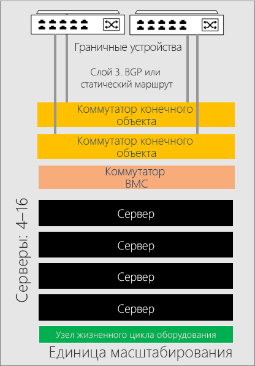
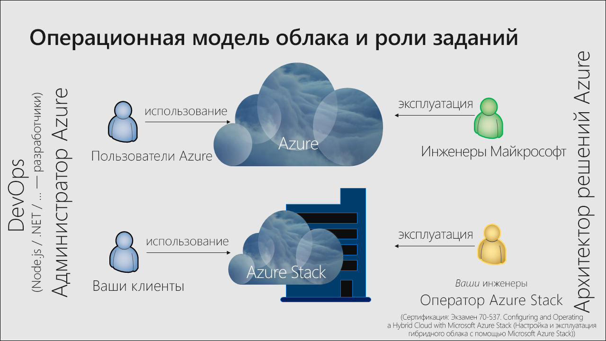

# Обзор Azure Stack Hub

Azure Stack Hub — это расширение Azure, которое позволяет запускать приложения в локальной среде и предоставлять службы Azure в центре обработки данных. Единообразная облачная платформа позволяет организациям уверенно принимать технологические решения на основе бизнес-требований, не позволяя технологическим ограничениям влиять на бизнес-решения.

## В чем преимущества Azure Stack Hub?

Azure предоставляет полнофункциональную платформу для разработчиков, позволяющую создавать современные приложения. К сожалению, при работе некоторых облачных приложениях возникают определенные проблемы, например задержки, прерывание связи или несоответствие требованиям. Azure в сочетании с Azure Stack Hub позволяет реализовать следующие новые гибридные сценарии для клиентских и внутренних бизнес-приложений:

- **Пограничные и отключенные решения.** Обеспечьте соблюдение требований к задержкам и стабильности подключения, локально обрабатывая данные в Azure Stack Hub и передавая их в Azure для аналитической обработки, применяя общую логику приложения в обоих средах. Вы можете развернуть Azure Stack Hub даже без подключения к Интернету и к Azure. Например, это удобно в фабричных цехах, на круизных лайнерах и в шахтах.

- **Облачные приложения, соответствующие различным нормам**. Разрабатывайте и развертывайте приложения в Azure, сохраняя широкие возможности при локальном развертывании в Azure Stack Hub для соблюдения всех требований политик и норм. Изменения кода не требуются. Примерами могут служить приложения глобального аудита, финансовой отчетности, валютной торговли, интернет-игр и отчетов о расходах.

- **Локальная облачная модель приложения**. Используйте веб-службы Azure, контейнеры, бессерверные архитектуры и микрослужбы для обновления и расширения существующих приложений, а также для создания новых. Соблюдайте согласованность процессов DevOps в облачной среде Azure и в локальном Azure Stack Hub, чтобы ускорить модернизацию критически важных приложений.

## Архитектура Azure Stack Hub

Интегрированные системы Azure Stack Hub состоят из 4–16 объединенных в стойку серверов. Они разрабатываются доверенными партнерами по оборудованию и доставляются прямо в ваш центр обработки данных. После доставки поставщик решения поможет вам развернуть интегрированную систему и убедиться, что решение Azure Stack Hub соответствует бизнес-требованиям вашей организации. Вы можете подготовить свой центр обработки данных, обеспечив необходимое электропитание, охлаждение и подключение к пограничной сети, а также выполнив другие требования для интеграции центра обработки данных.

> Дополнительные сведения о требованиях к интеграции для центра обработки данных Azure Stack Hub см. в статье [об интеграции центра обработки данных Azure Stack Hub](azure-stack-customer-journey.md).

Azure Stack Hub работает на стандартном для отрасли оборудовании и управляется теми же средствами, которые вы обычно используете для управления подписками Azure. Все это позволяет применять согласованные процессы DevOps независимо от наличия подключения к Azure.

Архитектура Azure Stack Hub позволяет предоставлять службы Azure на границе для удаленных расположений, при нестабильном или отсутствующем подключении к Интернету. Вы можете создать гибридные решения, которые обрабатывают данные локально в Azure Stack Hub и передают их в Azure для дополнительной обработки и анализа. Наконец, локальная установка Azure Stack Hub позволяет соответствовать определенным требованиям или политикам благодаря широким возможностям развертывания облачных приложений в локальной среде без изменения кода.

## Варианты развертывания

Интегрированные системы Azure Stack Hub предоставляются благодаря партнерским отношениям Майкрософт и партнеров по оборудованию. Это позволяет создать решение с инновациями облачного уровня и простотой управления вычислениями. Так как Azure Stack Hub предлагается в качестве встроенного оборудования и программного обеспечения системы, у вас есть необходимые возможности и элемент управления, а также возможность внедрять инновации облачного уровня. 

Интегрированная система Azure Stack Hub может включать 4–16 серверов, называемых *единицей масштабирования*. Интегрированные системы совместно поддерживаются партнером по оборудованию и продуктами Майкрософт. На приведенной ниже схеме показан пример единицы масштабирования. 

. 

<!---add info and image on regions, etc--->

### Модели подключения

Вы можете выбрать развертывание Azure Stack Hub **с подключением** к Интернету (и Azure) или в **автономном** режиме. 

> Изучите дополнительные сведения о [подключенной](azure-stack-connected-deployment.md) и [автономной](azure-stack-disconnected-deployment.md) моделях развертывания.

### Поставщик удостоверений 

Azure Stack Hub использует Azure Active Directory (Azure AD) или службы федерации Active Directory (AD FS). Azure AD — это облачный, мультитенантный поставщик удостоверений Майкрософт. В большинстве гибридные сценариев с подключенным к Интернету развертыванием в качестве хранилища идентификаторов используется AAD.

Вы можете использовать AD FS для развертываний Azure Stack Hub без подключения. Поставщики ресурсов Azure Stack Hub и другие приложения одинаково работают с AD FS и Azure AD. Azure Stack Hub включает собственный экземпляр Active Directory и API Graph Active Directory.

## Как управляется Azure Stack Hub?

В Azure Stack Hub используется та же модель операций, что и в Azure. Оператор Azure Stack Hub может предоставлять пользователям клиентов разнообразные службы и приложения так же, как корпорация Майкрософт предоставляет пользователям клиентов услуги Azure. 

Для управления Azure Stack Hub можно использовать портал администратора, портал пользователя или [PowerShell](https://docs.microsoft.com/powershell/azure/azure-stack/overview?view=azurestackps-1.7.1). Каждый портал Azure Stack Hub размещается в отдельных экземплярах Azure Resource Manager. **Оператор Azure Stack Hub** использует портал администратора для управления Azure Stack Hub и выполнения таких действий, как создание предложений для клиентов, поддержание работоспособности и мониторинг состояния интегрированной системы. Пользовательский портал предоставляет возможность самообслуживания при использовании облачных ресурсов, например, виртуальных машин, учетных записей хранилища и веб-приложений.

> Дополнительные сведения об управлении Azure Stack Hub с помощью портала администратора см. в [этом кратком руководстве](azure-stack-manage-portals.md).

Оператор Azure Stack Hub может предоставлять [виртуальные машины](azure-stack-tutorial-tenant-vm.md), [веб-приложения](azure-stack-app-service-overview.md), а также базы данных [SQL Server](azure-stack-tutorial-sql.md) и [MySQL Server](azure-stack-tutorial-mysql.md) с высоким уровнем доступности. С помощью [шаблонов Azure Resource Manager для быстрого запуска Azure Stack Hub](https://github.com/Azure/AzureStack-QuickStart-Templates) вы можете развернуть SharePoint, Exchange и многое другое.

Оператор может управлять Azure Stack Hub с помощью [портала администратора](azure-stack-manage-portals.md) или [PowerShell](https://docs.microsoft.com/powershell/azure/azure-stack/overview?view=azurestackps-1.7.1). Вы можете [настроить Azure Stack Hub для доставки служб](service-plan-offer-subscription-overview.md) клиентам, используя планы, квоты, предложения и подписки. Пользователи арендаторов могут подписаться на несколько предложений. В предложении может быть один или несколько планов, а в плане может быть одна или несколько служб. Операторы также управляют емкостью и реагируют на оповещения.

Пользователи потребляют службы, предлагаемые оператором. Пользователи могут подготавливать к работе, отслеживать службы, на которые они подписаны, например, веб-приложения, хранилище и виртуальные машины, а также управлять ими. Управлять Azure Stack Hub пользователи могут с помощью портала пользователя или PowerShell.

> Дополнительные сведения об управлении Azure Stack Hub, в том числе об использовании разных учетных записей, типичных обязанностях оператора, необходимых сообщениях для пользователей и получении справки и помощи, вы найдете в статье [об основах администрирования Azure Stack Hub](azure-stack-manage-basics.md).

## Поставщики ресурсов

Поставщиками ресурсов называют веб-службы, которые образуют основу для всех служб IaaS и PaaS на платформе Azure Stack Hub. Azure Resource Manager использует разные поставщики ресурсов для предоставления доступа к службам. Каждый из поставщиков ресурсов может оказать вам помощь в настройке соответствующих ресурсов и управлении ими. Кроме того, администраторы служб могут добавлять новые поставщики ресурсов.

### Базовые поставщики ресурсов

Существует три базовых поставщика ресурсов IaaS:

- **Среда выполнения приложений** Поставщик вычислительных ресурсов позволяет арендаторам Azure Stack Hub создавать собственные виртуальные машины. Поставщик вычислительных ресурсов предоставляет возможность создавать виртуальные машины и расширения для них. Служба расширений виртуальной машины обеспечивает возможности IaaS для виртуальных машин Windows и Linux. Например, вы можете использовать поставщика вычислительных ресурсов для предоставления виртуальной машины Linux и запуска Bash-скриптов во время развертывания для настройки виртуальной машины.
- **Поставщик сетевых ресурсов**: Поставщик сетевых ресурсов предоставляет ряд функций программно-конфигурируемой сети (SDN) и виртуализацию функций сети (NFV) для частного облака. С помощью поставщика сетевых ресурсов можно создавать такие ресурсы, как балансировщики нагрузки ПО, общедоступные IP-адреса, группы безопасности сети и виртуальные сети.
- **Поставщик ресурсов хранилища**: Поставщик ресурсов хранилища предоставляет четыре согласованных с Azure службы хранилища: для [BLOB-объектов](https://docs.microsoft.com/azure/storage/common/storage-introduction#blob-storage), [очередей](https://docs.microsoft.com/azure/storage/common/storage-introduction#queue-storage), [таблиц](https://docs.microsoft.com/azure/storage/common/storage-introduction#table-storage) и управления учетными записями [KeyVault](https://docs.microsoft.com/azure/key-vault/). Это позволяет администрировать и контролировать такие секретные данные, как пароли и сертификаты. Поставщик ресурсов хранилища предоставляет также облачную службу администрирования хранилища, чтобы облегчить администрирование служб совместимого с Azure хранилища. Служба хранилища Azure обеспечивает гибкость хранения и извлечения большого количества неструктурированных данных, таких как документы и мультимедийные файлы, с помощью больших двоичных объектов Azure, а также структурированных данных на основе NoSQL с помощью таблиц Azure.

### Дополнительные поставщики ресурсов

Существует три дополнительных поставщика ресурсов PaaS, которые можно развернуть и использовать с Azure Stack Hub:

- **Служба приложений**: [Служба приложений Azure в Azure Stack Hub](azure-stack-app-service-overview.md) — это предложение Microsoft Azure в формате PaaS для Microsoft Azure Stack Hub. Эта служба позволяет внутренним и внешним клиентам создавать веб-приложения, API и приложения Функций Azure для любых платформ и устройств.
- **SQL Server**. Чтобы предоставлять базы данных SQL как услуги в Azure Stack Hub, используйте [поставщик ресурсов SQL Server](azure-stack-sql-resource-provider.md). Установив поставщик ресурсов и подключив его к одному или нескольким экземплярам SQL Server, вы и ваши пользователи смогут создавать базы данных для облачных приложений, веб-сайтов с поддержкой SQL и других рабочих нагрузок, которые используют SQL.
- **MySQL Server**: Используйте [поставщик ресурсов MySQL Server](azure-stack-mysql-resource-provider-deploy.md), чтобы предоставлять доступ к базам данных MySQL в качестве службы Azure Stack Hub. Поставщик ресурсов MySQL выполняется как служба в виртуальной машине ядра Windows Server 2019.

## Дальнейшие действия

[Сравнение портфеля Azure Stack Hub](compare-azure-azure-stack.md)

[Основы администрирования](azure-stack-manage-basics.md)

[Краткое руководство. Использование портала администрирования Azure Stack Hub](azure-stack-manage-portals.md)

[Общие сведения об использовании и выставлении счетов](azure-stack-usage-reporting.md)
