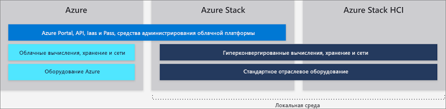

# Различия между глобальной средой Azure, Azure Stack и Azure Stack HCI

Майкрософт предоставляет семейство служб Azure и Azure Stack в рамках единой экосистемы Azure. Вы можете использовать модель приложения, порталы самообслуживания и API с Azure Resource Manager для доставки облачных возможностей независимо от ресурсов, на которых базируется ваш бизнес, будь то глобальная среда Azure или локальные ресурсы.

В этой статье описываются глобальная среда Azure, Azure Stack и Azure Stack HCI. Также здесь предоставлены общие рекомендации, которые помогут вам сделать оптимальный выбор относительно предоставления облачных служб Майкрософт для вашей организации.

## Глобальная среда Azure

Microsoft Azure — это постоянно расширяющийся набор облачных служб, который помогает вашей организации решать бизнес-задачи. Эта среда характеризуется свободным подходом к созданию и развертыванию приложений, а также управлению ими в обширной глобальной сети с использованием привычных инструментов и платформ.

Глобальная среда Azure предлагает более чем 100 служб в 54 регионах по всему миру. Актуальный список служб Azure см. в таблице [*доступности продуктов по регионам*](https://azure.microsoft.com/regions/services). Службы, предоставляемые в Azure, группируются по категориям, в том числе на общедоступные или доступные в рамках предварительной версии.

Дополнительные сведения о глобальных службах Azure см. в руководстве по [началу работы с Azure](https://docs.microsoft.com/azure/#pivot=get-started&panel=get-started1).

## Azure Stack

Azure Stack — это расширение Azure, которое обеспечивает гибкость и ускоряет внедрение инновационных облачных вычислительных решений в локальную среду. Развернутое в локальной среде, это решение Stack можно использовать для предоставления согласованных служб Azure,Microsoft Azure Stack, — как с подключением к Интернету (и Azure), так и без него. Azure Stack использует те же базовые технологии, что и глобальная среда Azure, включая следующие основные компоненты инфраструктуры как услуги (IaaS), программного обеспечения как услуга (SaaS) и дополнительные возможности платформы как услуги (PaaS):

- виртуальные машины Azure (Windows и Linux);
- Веб-приложения и Функции Azure;
- Хранилище ключей Azure
- Azure Resource Manager
- Azure Marketplace
- Контейнеры
- Центр Интернета вещей и Центры событий Azure;
- средства администрирования (планы, предложения, RBAC и т. д.).

Возможности PaaS, предоставляемые Azure Stack, являются дополнительными, так как Azure Stack управляется не корпорацией Майкрософт, а нашими клиентами. Это означает, что вы можете предложить пользователям любую службу PaaS, если вы можете абстрагировать базовую инфраструктуру и процессы для пользователей. При этом Azure Stack включает несколько дополнительных поставщиков услуг PaaS, таких как службы приложений, базы данных SQL и базы данных MySQL. Так как эти решения предоставляются как поставщики ресурсов, они являются мультитенантными, входят в пакеты стандартных последующих обновлений Azure Stack, отображаются на портале Azure Stack и интегрируются с Azure Stack.

Кроме описанных выше поставщиков ресурсов, предоставляются и дополнительные доступные службы PaaS, протестированные как [решения на основе шаблона Azure Resource Manager](https://github.com/Azure/AzureStack-QuickStart-Templates). Они запускаются в IaaS, но вы как оператор Azure Stack можете предлагать пользователям их в качестве следующих служб PaaS:

- Service Fabric
- Служба контейнеров Kubernetes
- Блокчейн Ethereum
- Cloud Foundry

### Сценарии использования Azure Stack:

- моделирование финансовых рисков;
- работа с медицинскими данными и утверждениями;
- аналитика устройств Интернета вещей;
- оптимизация ассортимента в розничной торговле;
- оптимизации логистических цепочек;
- Промышленный Интернет вещей
- диагностическое обслуживание;
- планирование смарт-городов;
- вовлечение граждан в работу муниципальных служб.

См. дополнительные сведения об [Azure Stack](azure-stack-overview.md).

## Azure Stack HCI 

Решения Azure Stack HCI позволяют запускать виртуальные машины в локальной среде и легко подключаться к Azure с помощью решения гиперконвергентной инфраструктуры (HCI). Создавайте и запускайте облачные приложения, используя согласованные службы Azure в локальной среде для соблюдения нормативных и технических требований. Кроме локального запуска виртуализированных приложений, решения Azure Stack HCI позволяют заменять и консолидировать устаревающую серверную инфраструктуру и подключаться к Azure для работы с облачными службами с помощью Центра администрирования Windows.

Azure Stack HCI предоставляет проверенные решения HCI, выполняемые на базе Hyper-V и Локальных дисковых пространств с использованием программно определяемых центров обработки данных Windows Server 2019. Центр администрирования Windows используется для интегрированного доступа к следующим службам Azure и управления ими:

- Служба архивации Azure
- Azure Site Recovery
- Azure Monitor и служба обновлений.

Обновленный список Azure служб, которые можно подключить к Azure Stack HCI для см. в руководстве по [подключению Windows Server к гибридным службам](https://docs.microsoft.com/windows-server/azure-hybrid-services/index).

### Сценарии использования Azure Stack HCI:
- удаленное администрирование или ветвление офисных систем;
- консолидация центров данных;
- работа с инфраструктурой виртуальных рабочих столов;
- работа с критически важной для бизнеса инфраструктурой;
- работа с более бюджетными хранилищами;
- обеспечение высокой доступности и аварийного восстановления в облако;
- работа с такими корпоративными приложениями, как SQL Server.

Посетите [веб-сайт Azure Stack HCI](https://azure.microsoft.com/overview/azure-stack/hci/), чтобы ознакомиться более чем с 70 решениями Azure Stack HCI, предоставляемыми сейчас партнерами Майкрософт.

## Дополнительная информация

[Основы администрирования Azure Stack](azure-stack-manage-basics.md)

[Краткое руководство. Использование портала администрирования Azure Stack](azure-stack-manage-portals.md)
