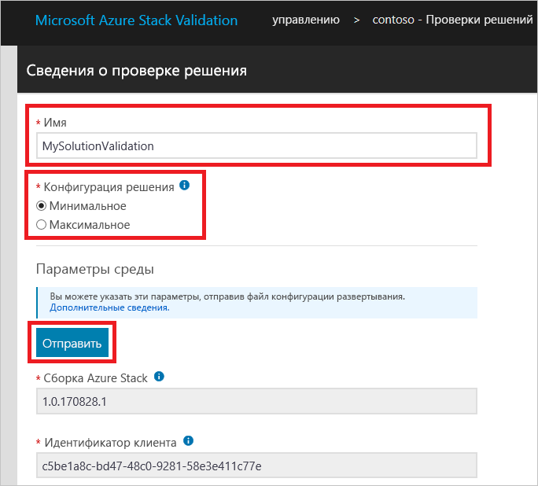

# Проверка нового решения Azure Stack Hub

[!INCLUDE [Azure_Stack_Partner](./includes/azure-stack-partner-appliesto.md)]

Узнайте, как использовать рабочий процесс **проверки решения** для сертификации новых решений Azure Stack Hub.

Решение Azure Stack Hub является спецификацией оборудования, которая была совместно согласована между корпорацией Майкрософт и партнером и которая соответствует сертификационным требованиям логотипа Windows Server. Решение должно быть повторно сертифицировано при изменении спецификации оборудования. При возникновении дополнительных вопросов о том, когда необходимо повторно сертифицировать решения, свяжитесь с командой по адресу [vaashelp@microsoft.com](mailto:vaashelp@microsoft.com).

Чтобы сертифицировать решение, необходимо дважды запустить рабочий процесс проверки решений. Запустите его один раз для *минимально* поддерживаемой конфигурации. Запустите его второй раз для *максимально* поддерживаемой конфигурации. Корпорация Майкрософт сертифицирует решение, если обе конфигурации прошли все тесты.

[!INCLUDE [azure-stack-vaas-workflow-validation-completion](includes/azure-stack-vaas-workflow-validation-completion.md)]

## Создание рабочего процесса проверки решений

1. [!INCLUDE [azure-stack-vaas-workflow-step_select-solution](includes/azure-stack-vaas-workflow-step_select-solution.md)]

3. Щелкните **Start** (Начать) на плитке **Solution Validations** (Проверка решений).

    

4. [!INCLUDE [azure-stack-vaas-workflow-step_naming](includes/azure-stack-vaas-workflow-step_naming.md)]

5. Выберите **конфигурацию решения**:
    - **Минимум** — для решения, настроенного с минимальным числом поддерживаемых узлов.
    - **Максимум** — для решения, настроенного с максимальным числом поддерживаемых узлов.
6. [!INCLUDE [azure-stack-vaas-workflow-step_upload-stampinfo](includes/azure-stack-vaas-workflow-step_upload-stampinfo.md)]

    

7. [!INCLUDE [azure-stack-vaas-workflow-step_test-params](includes/azure-stack-vaas-workflow-step_test-params.md)]

    > [!NOTE]
    > Параметры среды невозможно изменить после создания рабочего процесса.

8. [!INCLUDE [azure-stack-vaas-workflow-step_tags](includes/azure-stack-vaas-workflow-step_tags.md)]
9. [!INCLUDE [azure-stack-vaas-workflow-step_submit](includes/azure-stack-vaas-workflow-step_submit.md)]
    Вы будете перенаправлены на страницу сводок по тестам.

## Выполнение тестов проверки решений

На странице **сводки по тестам проверки решений** вы увидите список тестов, необходимых для завершения проверки.

В рабочих процессах проверки при **планировании** теста используются общие параметры уровня рабочего процесса, которые вы указали при его создании (см. раздел об [общих параметрах рабочих процессов для проверки как услуги в Azure Stack Hub](azure-stack-vaas-parameters.md)). Если какие-либо из значений параметров станут недействительными, необходимо указать их повторно, как описано в разделе об [изменении параметров рабочего процесса](azure-stack-vaas-monitor-test.md#change-workflow-parameters).

> [!NOTE]
> При планировании проверочного теста через существующий экземпляр на портале будет создан новый экземпляр вместо старого. Журналы для старого экземпляра будут сохранены, но недоступны на портале.  
После успешного завершения теста действие **Расписание** становится недоступным.

1. [!INCLUDE [azure-stack-vaas-workflow-step_select-agent](includes/azure-stack-vaas-workflow-step_select-agent.md)]

2. Выберите следующие тесты:
    - Cloud Simulation Engine (Механизм имитации в облаке).
    - Compute SDK Operational Suite (Операционный набор для пакета SDK для вычислений);
    - Disk Identification Test (Тест на идентификацию диска);
    - KeyVault Extension SDK Operational Suite (Операционный набор для пакета SDK для расширения хранилища ключей);
    - KeyVault SDK Operational Suite (Операционный набор для пакета SDK для хранилища ключей);
    - Network SDK Operational Suite (Операционный набор для пакета SDK для сети);
    - Storage Account SDK Operational Suite (Операционный набор для пакета SDK для учетной записи).

3. В контекстном меню выберите **Расписание**, чтобы открыть командную строку для планирования выполнения тестового экземпляра.

4. Проверьте параметры теста, а затем выберите **Отправить**, чтобы запланировать выполнение теста.

## Дальнейшие действия

- [Мониторинг теста с помощью проверки как услуги Azure Stack](azure-stack-vaas-monitor-test.md)