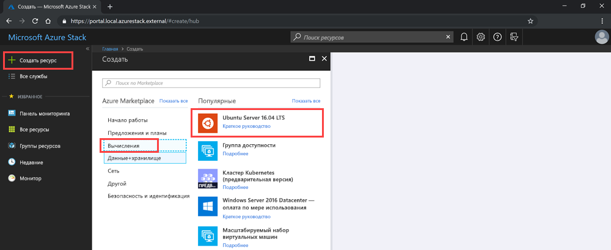

# <a name="deploy-a-linux-vm-to-host-a-web-app-in-azure-stack-hub"></a>Развертывание виртуальной машины Linux для размещения веб-приложения в Azure Stack Hub

Вы можете создать и развернуть базовую виртуальную машину Linux, используя образ Ubuntu в Azure Marketplace, чтобы разместить веб-приложение, созданное с помощью веб-платформы. 

На такой виртуальной машине можно размещать веб-приложения, используя:

- **Python**. Обычные веб-платформы Python: Flask, Bottle и Django.
- **Go**. Платформы Common Go: Revel, Martini, Gocraft/web и Gorilla. 
- **Ruby**. В качестве платформы для доставки ваших веб-приложений Ruby можно настроить Ruby on Rails. 
- **Java**. Для разработки веб-приложений, размещаемых на сервере Apache Tomcat, можно использовать Java. Вы можете установить Tomcat на Linux, а затем развернуть WAR-файлы Java непосредственно на сервере. 

Чтобы начать работу с любым веб-приложением, инфраструктурой и серверной технологией, использующей Linux, можно использовать инструкции в этой статье. Затем можно применить Azure Stack Hub для управления инфраструктурой и средства управления в вашей технологии для решения задач обслуживания вашего приложения.

## <a name="deploy-a-linux-vm-for-a-web-app"></a>Развертывание виртуальной машины Linux для веб-приложения

Во время выполнения этой процедуры вы создадите секретный ключ, будете использовать базовый образ виртуальной машины Linux, укажете определенные атрибуты виртуальной машины, а затем создадите виртуальную машину. После создания виртуальной машины вы откроете порты, необходимые для работы с этой виртуальной машиной и размещения на ней вашего приложения. Затем вы создадите DNS-имя. Наконец, вы подключитесь к виртуальной машине и обновите ее, используя служебную программу apt-get. После завершения процедуры у вас будет виртуальная машина, работающая в экземпляре Azure Stack Hub, которая готова для размещения веб-приложения.

Перед началом работы убедитесь, что у вас есть все, что нужно.

## <a name="prerequisites"></a>предварительные требования

- Подписка Azure Stack Hub с доступом к образу ​​Ubuntu Server 16.04 LTS. Вы можете использовать более позднюю версию образа, но эти инструкции написаны с учетом версии 16.04 LTS. Если у вас нет этого образа, обратитесь к оператору облака, чтобы получить образ в Marketplace Azure Stack Hub.

## <a name="deploy-the-vm-by-using-the-portal"></a>Развертывание виртуальной машины с помощью портала

Чтобы развернуть виртуальную машину, следуйте инструкциям в следующих нескольких разделах.

### <a name="create-your-vm"></a>Создание виртуальной машины

1. Создайте открытый ключ Secure Shell (SSH) для сервера. Дополнительные сведения см. в статье [Использование открытого ключа SSH](azure-stack-dev-start-howto-ssh-public-key.md).
1. На портале Azure Stack Hub выберите **Создать ресурс** > **Вычисления** > **Ubuntu Server 16.04 LTS**.

    

4. В области **Создание виртуальной машины** в разделе **1. Настройка основных параметров**:

    а. Введите **имя виртуальной машины**.

    b. Для параметра **Тип диска виртуальной машины** выберите **SSD (цен. категория "Премиум")** (для дисков ценовой категории "Премиум" [SSD]) или **HDD (цен. категория "Стандартный")** (для дисков ценовой категории "Стандартный" [HDD]).

    c. Введите **имя пользователя**.

    d. В поле **Тип проверки подлинности** выберите **Открытый ключ SSH**.

    д) Получите открытый ключ SSH, который вы создали. Откройте его в текстовом редакторе, а затем скопируйте ключ и вставьте его в поле **Открытый ключ SSH**. Включите текст от `---- BEGIN SSH2 PUBLIC KEY ----` до `---- END SSH2 PUBLIC KEY ----`. Вставьте весь блок текста в поле ключа:

    ```text  
    ---- BEGIN SSH2 PUBLIC KEY ----
    Comment: "rsa-key-20190207"
    <Your key block>
    ---- END SSH2 PUBLIC KEY ----
    ```

    е) Выберите подписку для экземпляра Azure Stack Hub.

    ж. Создайте новую или используйте существующую группу ресурсов, в зависимости от того, как вы хотите организовать ресурсы для приложения.

    h. Выберите расположение. Обычно Пакет средств разработки Azure Stack (ASDK) размещается в *локальном* регионе. Расположение зависит от экземпляра Azure Stack Hub.
1. В разделе **2. Размер** введите следующее.
    - Выберите размер данных и объем ОЗУ для виртуальной машины, которая доступна в вашем экземпляре Azure Stack Hub.
    - Можно просмотреть список или применить фильтр размера виртуальной машины по **типу вычислений**, **ЦП** и **дисковому пространству**.
    
    > [!NOTE]
    > - Все предлагаемые цены вычисляются в местной валюте. Они включают в себя только затраты на инфраструктуру Azure, а также все скидки, действующие для подписки и расположения. В них не входят затраты на соответствующее программное обеспечение. 
    > - Рекомендуемые размеры определяются издателем выбранного образа на основе требований к аппаратному и программному обеспечению.
    > - Применение дисков ценовой категории "Стандартный" (HDD), а не дисков ценовой категории "Премиум" (SSD) может снизить производительность операционной системы.

1. В разделе **3. Настройка дополнительных возможностей** введите следующее.

    а. Для параметра **Высокий уровень доступности** выберите группу доступности. Чтобы обеспечить избыточность приложения, объедините две или больше виртуальных машин в группу доступности. Эта конфигурация обеспечит доступность не менее одной виртуальной машины и соблюдение Соглашения об уровне обслуживания Azure 99,95 % как при событиях запланированного обслуживания, так и при незапланированного. Невозможно изменить группу доступности виртуальной машины после ее создания.

    b. Для параметра **Хранилище** выберите значение **Premium disks (SSD)** (Диски цен. категории "Премиум" (SSD)) или **Standard disks (HDD)** (Диски цен. категории "Премиум" (HDD)). Диски цен. категории "Премиум" поддерживаются твердотельными накопителями и обеспечивают стабильную производительность с низкой задержкой. Они обеспечивают оптимальное соотношение цены и производительности и идеально подходят для приложений с интенсивным вводом-выводом и для производственных рабочих нагрузок. Диски ценовой категории "Стандартный" используют диски с магнитной записью и предпочтительны для приложений, в которых доступ к данным осуществляется редко. Избыточные между зонами диски используют хранилище, избыточное между зонами (ZRS), которое реплицирует ваши данные в несколько зон, и они доступны, даже если одна зона не работает. 

    c. Выберите **Использовать управляемые диски**. При включении этой функции Azure автоматически управляет доступностью дисков. Вы можете использовать преимущества избыточности данных и отказоустойчивости без необходимости создавать учетные записи хранения и управлять ими самостоятельно. Управляемые диски могут быть доступными не во всех регионах. Дополнительные сведения см. в статье [Общие сведения об управляемых дисках Azure](https://docs.microsoft.com/azure/virtual-machines/windows/managed-disks-overview).

    d. Чтобы настроить сеть, щелкните **Виртуальная сеть**. Виртуальные сети в Azure логически изолированы друг от друга. Для них можно настроить диапазоны IP-адресов, подсети, таблицы маршрутов, шлюзы и параметры безопасности, как и для традиционной сети в центре обработки данных. Виртуальные машины в одной виртуальной сети могут взаимодействовать между собой по умолчанию. 

    д) Чтобы настроить подсеть, выберите **Подсеть**. Подсеть — это диапазон IP-адресов в виртуальной сети. Подсеть можно использовать, чтобы изолировать виртуальные машины друг от друга или от Интернета. 

    е) Чтобы настроить доступ к виртуальной машине или службам, выполняющимся на ней, выберите **Общедоступный IP-адрес**. Используйте общедоступный IP-адрес для взаимодействия с виртуальной машиной извне виртуальной сети. 

    ж. Выберите **Группа безопасности сети**, затем выберите **Стандартная** или **Расширенная**. Задайте правила, разрешающие или запрещающие передачу сетевого трафика на виртуальную машину. 

    h. Чтобы настроить доступ к виртуальной машине с помощью общих или пользовательских протоколов, выберите **Общедоступные входящие порты**. Служба указывает целевой протокол и диапазон портов для этого правила. Можно выбрать предопределенную службу, например протокол удаленного рабочего стола (RDP) или SSH, или указать свой диапазон портов. 
        Для веб-сервера используйте протоколы HTTP (80), SSH (22) и HTTPS (443) и откройте указанные порты. Если вы планируете управлять компьютером с помощью RDP-подключения, откройте порт 3389.

    i. Чтобы добавить расширения на виртуальную машину, выберите **Расширения**. С помощью расширений на виртуальную машину можно добавить новые функции, такие как управление конфигурацией или антивирусная защита. 

    j. Включите или отключите параметр **Мониторинг**. Чтобы упростить диагностику проблем при запуске, можно использовать мониторинг. Это позволит записывать выходные данные последовательной консоли и снимки экрана виртуальной машины, работающей на узле. 

    k. Чтобы указать учетную запись хранения для хранения данных метрик, выберите **Учетная запись хранения диагностики**. Данные метрик записываются в учетную запись хранения, чтобы вы могли анализировать их с помощью собственных инструментов. 

    l. Нажмите кнопку **ОК**.

1. Просмотрите сведения на странице **4. Сводка**.
    - Портал проверит ваши параметры.
    - Чтобы многократно использовать параметры для рабочего процесса Azure Resource Manager, можно скачать шаблон Azure Resource Manager для своей виртуальной машины.
    - После прохождения проверки нажмите кнопку **ОК**. Развертывание виртуальной машины занимает несколько минут.

### <a name="specify-the-open-ports-and-dns-name"></a>Указание открытых портов и DNS-имени

Чтобы сделать веб-приложение доступным для пользователей в сети, откройте порты, используемые для подключения к компьютеру, и добавьте понятное DNS-имя, например *mywebapp.local.cloudapp.azurestack.external*, которое пользователи смогут использовать в веб-браузерах.

#### <a name="open-inbound-ports"></a>Открытие входящих портов

Вы можете изменить целевой протокол и диапазон портов для предопределенной службы, например RDP или SSH, или указать свой диапазон портов. Например, может потребоваться использовать диапазон портов вашей веб-платформы. Например, GO обменивается данными через порт 3000.

1. Откройте портал Azure Stack Hub для своего клиента.

1. Найдите вашу виртуальную машину. Возможно, вы закрепили ее на панели мониторинга. Найти виртуальную машину можно с помощью поля **Поиск ресурсов**.

1. Выберите **Сети** в области виртуальной машины.

1. Выберите **Добавить правило входящего порта**, чтобы открыть порт.

1. Для параметра **Приоритет** оставьте значение по умолчанию — **Любой**.

1. Для параметра **Диапазон исходных портов** оставьте подстановочный знак (*).

1. В поле **Диапазон портов назначения** введите порт, который нужно открыть, например **3000**.

1. Для параметра **Протокол** оставьте значение по умолчанию — **Любой**.

1. В поле **Действие** выберите **Разрешить**.

1. Оставьте значение по умолчанию для параметра **Приоритет**.

1. Введите **имя** и **описание**. Это поможет запомнить, почему порт был открыт.

1. Выберите **Добавить**.

#### <a name="add-a-dns-name-for-your-server"></a>Добавление DNS-имени для сервера

Можно создать DNS-имя сервера, чтобы пользователи могли подключаться к вашему веб-сайту с помощью URL-адреса.

1. Откройте портал Azure Stack Hub для своего клиента.

1. Найдите вашу виртуальную машину. Возможно, вы закрепили ее на панели мониторинга. Найти виртуальную машину можно с помощью поля **Поиск ресурсов**.

1. Щелкните **Обзор**.

1. В разделе **Виртуальная машина** выберите **Настроить**.

1. Для параметра **Назначение** выберите значение **Динамическое**.

1. Введите метку DNS-имени, например **mywebapp**, чтобы полный URL-адрес имел вид *mywebapp.local.cloudapp.azurestack.external* (для приложения, использующего ASDK).

### <a name="connect-via-ssh-to-update-your-vm"></a>Подключение по протоколу SSH для обновления виртуальной машины

1. В сети, в которой размещен экземпляр Azure Stack Hub, откройте клиент SSH. Дополнительные сведения см. в разделе [Использование открытого ключа SSH](azure-stack-dev-start-howto-ssh-public-key.md).

1. Введите следующие команды:

    ```bash  
        sudo apt-get update
        sudo apt-get -y upgrade
    ```

## <a name="next-steps"></a>Дальнейшие действия

Узнайте, как [настроить среду разработки в Azure Stack Hub](azure-stack-dev-start.md).
