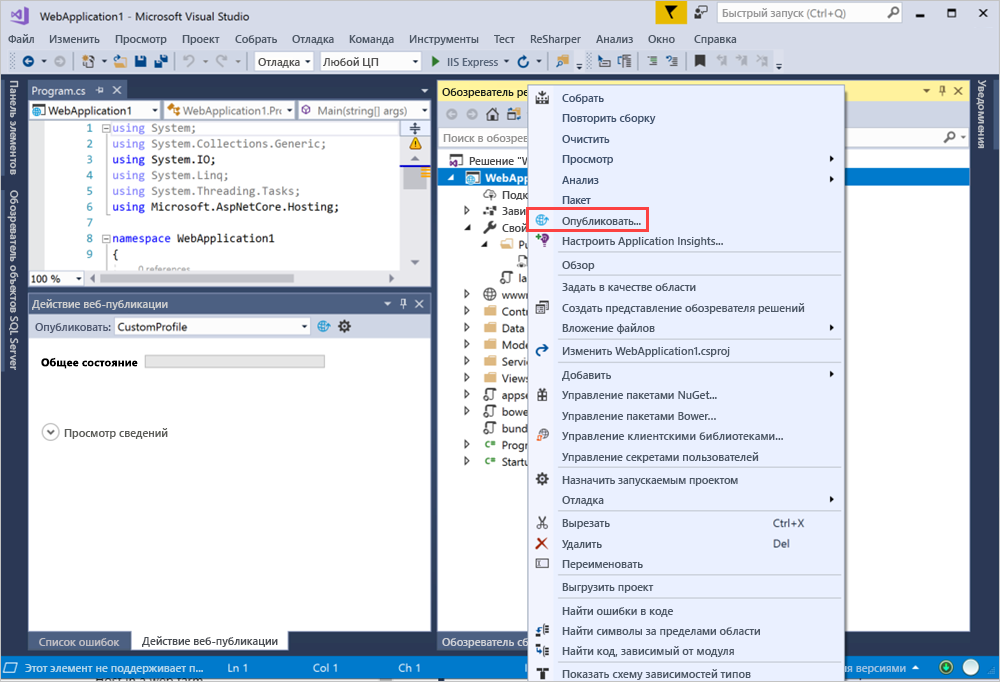
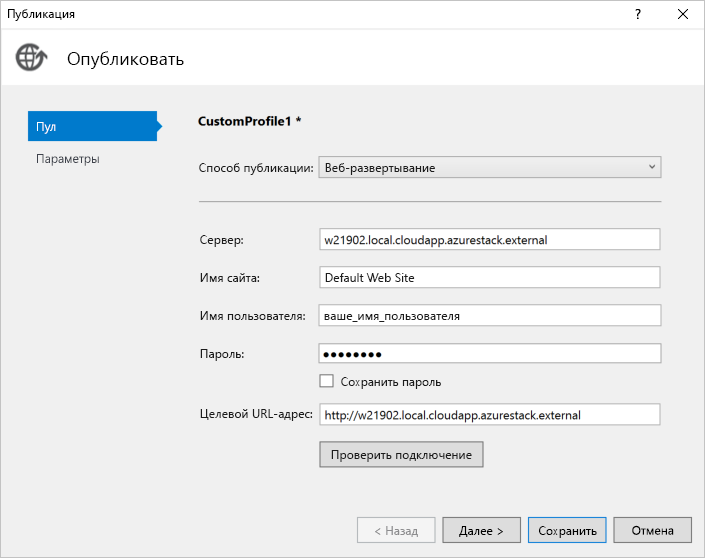

# <a name="deploy-a-c-aspnet-web-app-to-a-vm-in-azure-stack-hub"></a>Развертывание веб-приложения C# ASP.NET на виртуальной машине в Azure Stack Hub

Вы можете создать виртуальную машину для размещения веб-приложения C# ASP.NET в Azure Stack Hub. В этой статье приведены инструкции по установке сервера, его настройке для размещения вашего веб-приложения C# ASP.NET и развертыванию этого приложения непосредственно из Visual Studio.

В этой статье используется приложение C# 6.0, в котором применяется ASP.NET Core 2.2, работающее на сервере Windows 2016.

## <a name="create-a-vm"></a>Создание виртуальной машины

1. Создайте [виртуальную машину Windows Server](azure-stack-quick-windows-portal.md).

1. Чтобы установить IIS (с помощью консоли управления) и компоненты ASP.NET 4.6 на виртуальной машине, выполните следующий сценарий.

    ```PowerShell  
    # Install IIS (with Management Console)
    Install-WindowsFeature -name Web-Server -IncludeManagementTools
    
    # Install ASP.NET 4.6
    Install-WindowsFeature Web-Asp-Net45
    
    # Install Web Management Service
    Install-WindowsFeature -Name Web-Mgmt-Service
    ```

1. Скачайте [веб-развертывания версии 3.6](https://www.microsoft.com/download/details.aspx?id=43717). Установите его с помощью MSI-файла, а затем включите все компоненты.

1. Установите на сервер пакет размещения .NET Core 2.2. Инструкции можно просмотреть на странице [установщика .NET Core](https://dotnet.microsoft.com/download/dotnet-core/2.2). Убедитесь, что вы используете одну и ту же версию .NET Core на компьютере разработки и целевом сервере.

1. На портале Azure Stack Hub откройте порты, перечисленные в параметрах сети для виртуальной машины.

    а. Откройте портал Azure Stack Hub для своего клиента.

    b. Найдите вашу виртуальную машину. Возможно, вы закрепили ее на панели мониторинга. Найти виртуальную машину можно с помощью поля **Поиск ресурсов**.

    c. Выберите **Сети**.

    d. В разделе виртуальной машины выберите **Добавить правило входящего порта**.

    д) Добавьте правило безопасности для входящего трафика для следующих портов:

    | Порт | Протокол | Description |
    | --- | --- | --- |
    | 80 | HTTP | HTTP — это протокол, который используется для доставки веб-страниц с серверов. Клиенты подключаются по протоколу HTTP, используя DNS-имя или IP-адрес. |
    | 443 | HTTPS | HTTPS — это безопасная версия протокола HTTP, которая использует сертификат безопасности и обеспечивает передачу данных в зашифрованном виде.  |
    | 22 | SSH | Secure Shell (SSH) — это сетевой протокол с применением шифрования для безопасного обмена данными. Вы будете использовать это соединение с клиентом SSH для настройки виртуальной машины и развертывания приложений. |
    | 3389 | RDP | Необязательный параметр. Протокол удаленного рабочего стола позволяет выполнять подключение к удаленному рабочему столу, чтобы использовать графический пользовательский интерфейс вашего компьютера.   |
    | 8172 | Другой | Порт, используемый WebDeploy. |

    Для каждого порта:

    а. В поле **Источник** выберите **Любой**.

    b. В поле **Диапазон исходных портов** введите звездочку ( **\*** ).

    c. Для параметра **Назначение** выберите значение **Любой**.

    d. Добавьте порт, который вы хотите открыть, в поле **Диапазон портов назначения**.

    д) Для параметра **Протокол** выберите значение **Любой**.

    е) В поле **Действие** выберите **Разрешить**.

    ж. Оставьте значение по умолчанию для параметра **Приоритет**.

    h. Введите **имя** и **описание**. Это поможет запомнить, почему порт был открыт.

    i. Выберите **Добавить**.

1.  В параметрах **Сеть** для своей виртуальной машины в Azure Stack Hub создайте DNS-имя для сервера. Пользователи могут подключаться к веб-сайту по URL-адресу.

    а. Откройте портал Azure Stack Hub для своего клиента.

    b. Найдите вашу виртуальную машину. Возможно, вы закрепили ее на панели мониторинга. Найти виртуальную машину можно с помощью поля **Поиск ресурсов**.

    c. Щелкните **Обзор**.

    d. В разделе **Виртуальная машина** выберите **Настроить**.

    д) Для параметра **Назначение** выберите значение **Динамическое**.

    е) Введите метку DNS-имени, например **mywebapp**, чтобы полный URL-адрес имел вид *mywebapp.local.cloudapp.azurestack.external*.

## <a name="create-an-app"></a>Создание приложения 

Вы можете использовать собственное веб-приложение или пример из статьи [Учебник. Начало работы с Razor Pages в ASP.NET Core](https://docs.microsoft.com/aspnet/core/tutorials/razor-pages/razor-pages-start?view=aspnetcore-2.2&tabs=visual-studio
). В этой статье описывается, как создать веб-приложение ASP.NET и опубликовать его на виртуальной машине Azure с помощью функции публикации виртуальных машин Azure в Visual Studio 2017. После установки приложения убедитесь, что оно запущено локально, и обновите цель публикации на виртуальной машине Windows в своем экземпляре Azure Stack Hub.

## <a name="deploy-and-run-the-app"></a>Развертывание и запуск приложения

Создайте цель публикации на виртуальной машине в Azure Stack Hub.

1. Щелкните правой кнопкой мыши проект в **обозревателе решений** и выберите **Опубликовать**.

    

1. В окне **Публикация** выберите **Создать профиль**.
1. Выберите **IIS, FTP и т. д.**
1. Нажмите кнопку **Опубликовать**.
1. Выберите значение **Веб-развертывание** для параметра **Метод публикации**.
1. В поле **Сервер** введите DNS-имя, которое было определено ранее, например *w21902.local.cloudapp.azurestack.external*.
1. В поле **Имя веб-сайта** введите **Веб-сайт по умолчанию**.
1. В поле **Имя пользователя** введите имя пользователя для компьютера.
1. В поле **Пароль** введите пароль для этого компьютера.
1. В поле **URL-адрес назначения** введите URL-адрес для сайта, например *mywebapp.local.cloudapp.azurestack.external*.

    

1. Выберите **Проверить подключение**, чтобы проверить конфигурацию веб-развертывания. Нажмите кнопку **Далее**.
1. Для параметра **Конфигурация** выберите значение **Выпуск**.
1. Задайте значение **netcoreapp2.2** для параметра **Целевая платформа**.
1. Задайте значение **Переносимая** для параметра **Целевая среда выполнения**.
1. Щелкните **Сохранить**.
1. Нажмите кнопку **Опубликовать**.
1. Перейдите на новый сервер. Вы увидите запущенное веб-приложение.

    ```http  
        mywebapp.local.cloudapp.azurestack.external
    ```

## <a name="next-steps"></a>Дальнейшие действия

- Узнайте, как [настроить среду разработки в Azure Stack Hub](azure-stack-dev-start.md).
- Дополнительные сведения о распространенных сценариях развертывания IaaS для Azure Stack Hub см. [здесь](azure-stack-dev-start-deploy-app.md).
- Дополнительные сведения о языке программирования C# и дополнительные ресурсы см. в [руководстве по C#](https://docs.microsoft.com/dotnet/csharp/).
