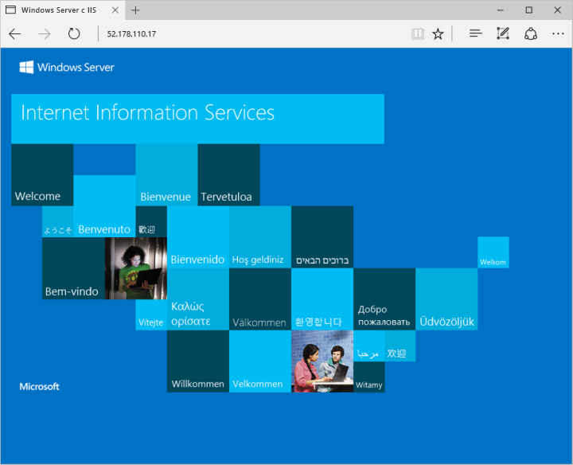

# <a name="quickstart-create-a-windows-server-virtual-machine-using-azure-cli-in-azure-stack-hub"></a>Краткое руководство. Создание виртуальной машины Windows Server с помощью Azure CLI в Azure Stack Hub

Вы можете создать виртуальную машину Windows Server 2016 с помощью Azure CLI. Чтобы создать и использовать виртуальную машину, выполните описанные в этой статье действия. В этой статье представлены инструкции, которые помогут вам:

* подключиться к виртуальной машине через удаленный клиент;
* установить веб-сервер IIS и открыть его стандартную домашнюю страницу;
* очистить использованные ресурсы.

## <a name="prerequisites"></a>Предварительные требования

* Убедитесь, что оператор Azure Stack Hub добавил образ **Windows Server 2016** в Azure Stack Hub Marketplace.

* Для создания ресурсов и управления ими в Azure CLI требуется определенная версия Azure Stack Hub. Если вы еще не настроили Azure CLI для Azure Stack Hub, выполните инструкции по [установке и настройке](azure-stack-version-profiles-azurecli2.md) Azure CLI.

## <a name="create-a-resource-group"></a>Создание группы ресурсов

Группа ресурсов — это логический контейнер, в котором вы можете развертывать ресурсы Azure Stack Hub и управлять ими. В окружении Azure Stack Hub выполните команду [az group create](/cli/azure/group#az-group-create), чтобы создать группу ресурсов.

> [!NOTE]
>  В примерах кода всем переменным уже присвоены значения. Но вы можете изменить эти значения, если потребуется.

В следующем примере создается группа ресурсов с именем myResourceGroup в локальном расположении.

```cli
az group create --name myResourceGroup --location local
```

## <a name="create-a-virtual-machine"></a>Создание виртуальной машины

Создайте виртуальную машину с помощью команды [az vm create](/cli/azure/vm#az-vm-create). В следующем примере создаются виртуальная машина с именем myVM В этом примере используются следующие учетные данные администратора: имя Demouser и пароль Demouser@123. Укажите вместо них значения, подходящие для вашей среды.

```cli
az vm create \
  --resource-group "myResourceGroup" \
  --name "myVM" \
  --image "Win2016Datacenter" \
  --admin-username "Demouser" \
  --admin-password "Demouser@123" \
  --location local
```

При создании виртуальной машины параметр **PublicIPAddress** в выходных данных содержит общедоступный IP-адрес виртуальной машины. Запишите этот адрес, так как он понадобится позже для доступа к виртуальной машине.

## <a name="open-port-80-for-web-traffic"></a>Открытие порта 80 для веб-трафика

Так как на этой виртуальной машине будет выполняться веб-сервер IIS, порт 80 должен быть доступным из Интернета.

Выполните команду [az vm open-port](/cli/azure/vm), чтобы открыть порт 80.

```cli
az vm open-port --port 80 --resource-group myResourceGroup --name myVM
```

## <a name="connect-to-the-virtual-machine"></a>Подключитесь к виртуальной машине

Используйте следующую команду для создания подключения удаленного рабочего стола к виртуальной машине. Замените "Общедоступный IP-адрес" IP-адресом виртуальной машины. При появлении запроса введите имя пользователя и пароль, которые вы указали для виртуальной машины.

```
mstsc /v <Public IP Address>
```

## <a name="install-iis-using-powershell"></a>Установка IIS с помощью PowerShell

Итак, вы вошли на виртуальную машину и теперь можете установить на ней IIS с помощью PowerShell. Откройте на виртуальной машине сеанс PowerShel и выполните следующую команду:

```powershell
Install-WindowsFeature -name Web-Server -IncludeManagementTools
```

## <a name="view-the-iis-welcome-page"></a>Просмотр страницы приветствия IIS

Страницу приветствия IIS по умолчанию можно просмотреть в любом браузере. Чтобы перейти на эту страницу, используйте общедоступный IP-адрес, записанный в предыдущем разделе.



## <a name="clean-up-resources"></a>Очистка ресурсов

Очистите ресурсы, которые вам больше не нужны. Чтобы удалить группу ресурсов, виртуальную машину и все связанные с ними ресурсы, используйте команду [az group delete](/cli/azure/group#az-group-delete).

```cli
az group delete --name myResourceGroup
```

## <a name="next-steps"></a>Дальнейшие действия

В этом кратком руководстве вы развернули простую виртуальную машину Windows Server. Дополнительные сведения о виртуальных машинах Azure Stack Hub см. в [рекомендациях по работе с виртуальными машинами в Azure Stack Hub](azure-stack-vm-considerations.md).
