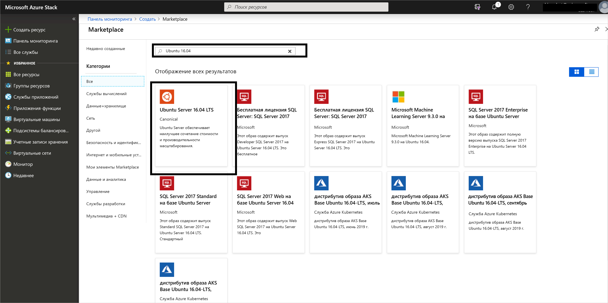
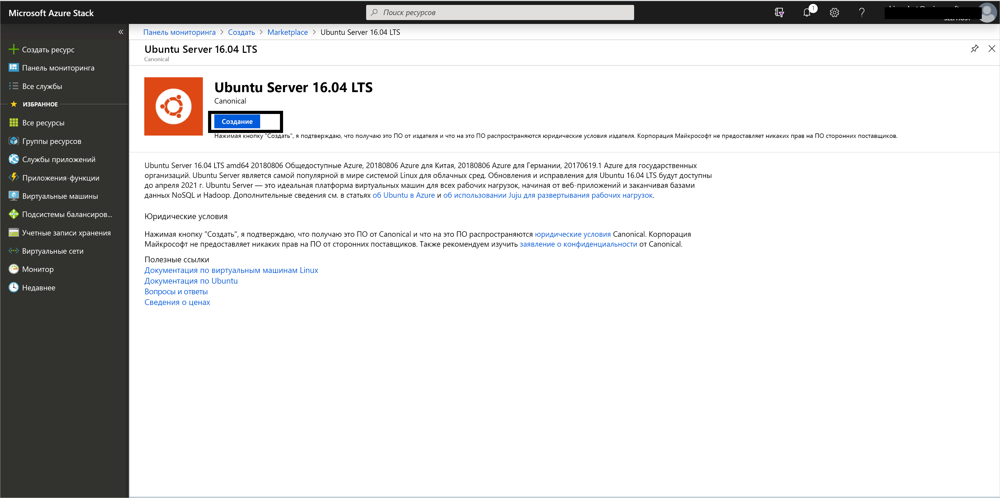
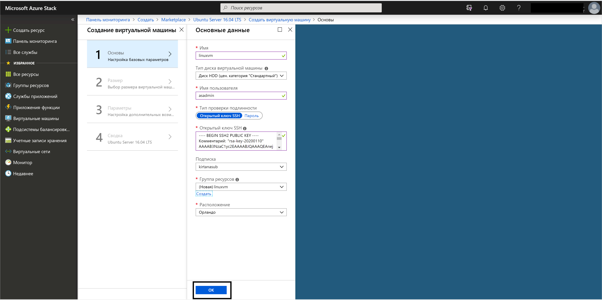
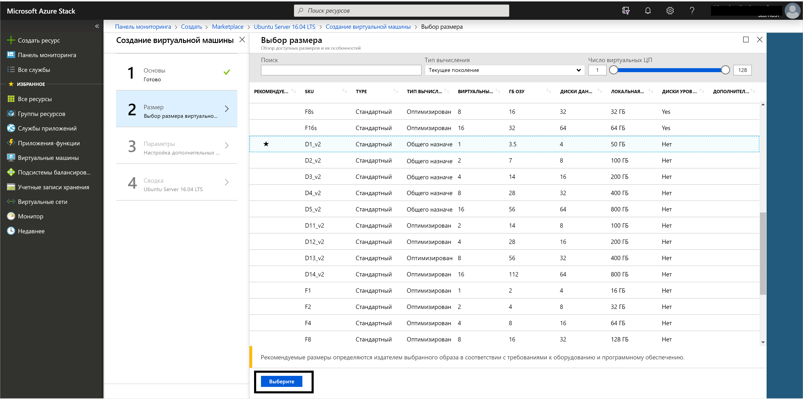
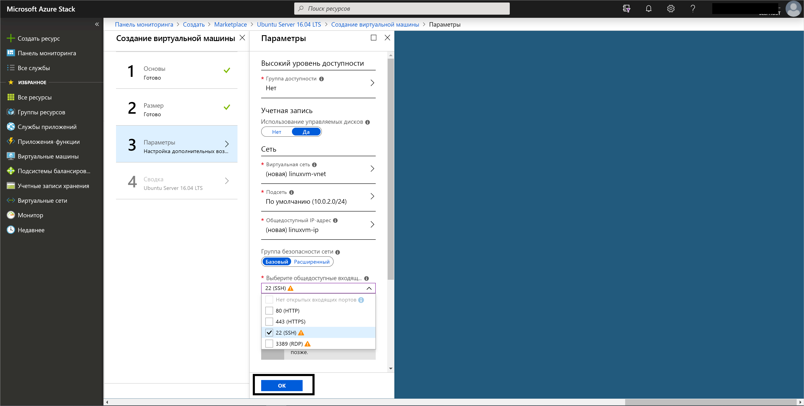
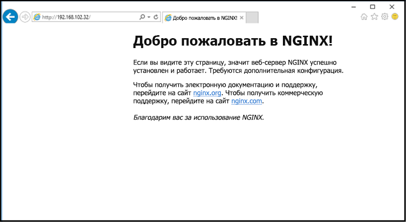

# <a name="quickstart-create-a-linux-server-vm-by-using-the-azure-stack-hub-portal"></a>Краткое руководство. Создание виртуальной машины с сервером Linux с помощью портала Azure Stack Hub.

Вы можете создать виртуальную машину Ubuntu Server 16.04 LTS с помощью портала Azure Stack Hub. В этой статье описано, как создать и использовать виртуальную машину. Здесь также объясняется, как выполнить следующие задачи:

* подключиться к виртуальной машине через удаленный клиент;
* установить веб-сервер NGINX;
* очистить использованные ресурсы.

> [!NOTE]  
> Изображения в этой статье обновлены в соответствии с изменениями, внесенными в Azure Stack Hub версии 1808. В версии 1808 добавлена поддержка *управляемых дисков* в дополнение к неуправляемым дискам. Если вы используете более раннюю версию, изображения для некоторых задач (например, выбор диска) отличаются от экранов пользовательского интерфейса.  

## <a name="prerequisites"></a>Предварительные требования

* Образ Linux в Azure Stack Hub Marketplace.

   По умолчанию Azure Stack Hub Marketplace не содержит образ Linux. Обратитесь к оператору Azure Stack Hub, чтобы он предоставил нужный образ Ubuntu Server 16.04 LTS. Для этого оператор может выполнить инструкции из статьи [Скачивание элементов Marketplace из Azure в Azure Stack Hub](../operator/azure-stack-download-azure-marketplace-item.md).

* Доступ к клиенту SSH

   Если вы используете Пакет средств разработки Azure Stack (ASDK), клиент Secure Shell (SSH) может быть недоступен. Если вам нужен клиент, используйте любой из нескольких пакетов, которые включают клиент SSH. Например, в состав PuTTY входят клиент SSH и генератор ключей SSH (puttygen.exe). Дополнительные сведения о доступных пакетах см. в статье [Использование открытого ключа SSH](azure-stack-dev-start-howto-ssh-public-key.md).

* В рамках этого краткого руководства с помощью PuTTY создаются ключи SSH и устанавливается подключение к виртуальной машине с сервером Linux. [Скачайте и установите PuTTY](https://www.putty.org).

## <a name="create-an-ssh-key-pair"></a>Создание пары ключей SSH

Чтобы выполнить все инструкции, приведенные в этой статье, вам понадобится пара ключей SSH. Если у вас уже есть эта пара, можно перейти к следующему шагу.

Чтобы создать пару ключей SSH, сделайте следующее:

1. Перейдите в папку установки PuTTY (по умолчанию это папка *C:\Program Files\PuTTY*) и выполните эту команду:

    `puttygen.exe`

1. В окне **генератора ключей PuTTY** выберите для параметра **Type of key to generate** (Тип создаваемого ключа) значение **RSA**, а для параметра **Number of bits in a generated key** (Количество битов в создаваемом ключе) — значение **2048**.

   

1. Выберите **Создать**.

1. Чтобы создать ключ, переместите указатель мыши в любое место в поле **Key** (Ключ).

1. Когда ключ будет создан, выберите **Save public key** (Сохранить открытый ключ) и **Save private key** (Сохранить закрытый ключ), чтобы сохранить файлы ключей.

   

## <a name="sign-in-to-the-azure-stack-hub-portal"></a>Войдите на портал Azure Stack Hub.

Адрес портала Azure Stack Hub зависит от того, к какому продукту Azure Stack Hub вы подключаетесь.

* Для ASDK перейдите по ссылке https://portal.local.azurestack.external.

* При работе с интегрированной системой Azure Stack Hub используйте URL-адрес, предоставленный оператором Azure Stack Hub.

## <a name="create-the-vm"></a>Создание виртуальной машины

1. Щелкните **Создать ресурс** > **Вычисление**. Найдите параметр `Ubuntu Server 16.04 LTS`. Выберите имя.

   

1. Нажмите кнопку **создания**.

   

1. Введите сведения о виртуальной машине. Для параметра "Тип проверки подлинности" выберите **Открытый ключ SSH**, вставьте сохраненное значение ключа SSH и щелкните **ОК**.

    > [!Note]  
    > Обязательно удалите из ключа все начальные и конечные пробелы.

   

1. Выберите для виртуальной машины размер **D1_v2**.

   

1. Внесите изменения в значения по умолчанию в колонке **Параметры**, чтобы использовать управляемые диски. Если вам нужен доступ по протоколу SSH, выберите **SSH (22)** , чтобы открыть этот порт. Завершив настройку конфигураций, щелкните **ОК**.

   

1. На странице "Сводка" щелкните **ОК**, чтобы начать развертывание виртуальной машины. Чтобы увидеть новую виртуальную машину, щелкните **Виртуальные машины**, найдите виртуальную машину по имени и выберите ее в результатах поиска.


## <a name="connect-to-the-vm"></a>Подключение к виртуальной машине

1. Нажмите кнопку **Подключить** на странице виртуальной машины. Отобразится строка подключения по протоколу SSH, которая нужна для подключения к виртуальной машине. 

1. На странице **PuTTY Configuration** (Конфигурация PuTTY) прокрутите вниз в области **Category** (Категория), разверните узел **SSH** и выберите **Auth** (Проверка подлинности). 

   

1. Нажмите кнопку **Browse** (Обзор) и выберите файл закрытого ключа, который вы сохранили.

1. На панели **Category** (Категория) прокрутите вверх и выберите **Session** (Сеанс).

1. В поле **Имя узла или IP-адрес** вставьте строку подключения, которая отображается на портале Azure Stack Hub. В нашем примере это строка *asadmin@192.168.102.34* .

1. Щелкните **Open** (Открыть), чтобы открыть сеанс подключения к виртуальной машине.

   

## <a name="install-the-nginx-web-server"></a>Установка веб-сервера NGINX

Чтобы обновить источники пакетов и установить последнюю версию пакета NGINX на виртуальной машине, введите следующие команды bash:

```bash
#!/bin/bash

# update package source
sudo apt-get -y update

# install NGINX
sudo apt-get -y install nginx
```

Когда установка NGINX завершится, закройте сеанс SSH и откройте страницу **Общие сведения** для виртуальной машины на портале Azure Stack Hub.

## <a name="open-port-80-for-web-traffic"></a>Открытие порта 80 для веб-трафика

Группа безопасности сети (NSG) защищает входящий и исходящий трафик. При создании виртуальной машины на портале Azure Stack Hub также создается правило, которое разрешает входящий трафик для SSH-подключений через порт 22. Так как на этой виртуальной машине размещается веб-сервер, необходимо создать правило NSG, которое разрешает веб-трафик через порт 80.

1. На странице **Общие сведения** щелкните имя **группы ресурсов**.

1. Выберите **группу безопасности сети** для виртуальной машины. Определить группу безопасности сети можно с помощью столбца **Тип**.

1. В левой области **Параметры** выберите **Правила безопасности для входящего трафика**.

1. Выберите **Добавить**.

1. В поле **Имя** введите **http**. 

1. Убедитесь, что для параметра **Диапазон портов** задано значение 80, а для параметра **Действие** — значение **Разрешить**.

1. Щелкните **ОК**.

## <a name="view-the-welcome-to-nginx-page"></a>Просмотр страницы приветствия NGINX

Теперь, когда на виртуальной машине установлен сервер NGINX и открыт порт 80, вы можете обращаться к веб-серверу по общедоступному IP-адресу этой виртуальной машины. (Общедоступный IP-адрес отображается на странице **Общие сведения** для виртуальной машины).

Откройте браузер и перейдите по адресу *http://\<общедоступный IP-адрес>* .



## <a name="clean-up-resources"></a>Очистка ресурсов

Очистите ресурсы, которые вам больше не нужны. Чтобы удалить виртуальную машину и ее ресурсы, выберите группу ресурсов на странице виртуальной машины и щелкните **Удалить**.

## <a name="next-steps"></a>Дальнейшие действия

С помощью этого краткого руководства вы развернули простую виртуальную машину с веб-сервером Linux. Дополнительные сведения о виртуальных машинах Azure Stack Hub см. в статье [Рекомендации по использованию виртуальных машин в Azure Stack Hub](azure-stack-vm-considerations.md).
