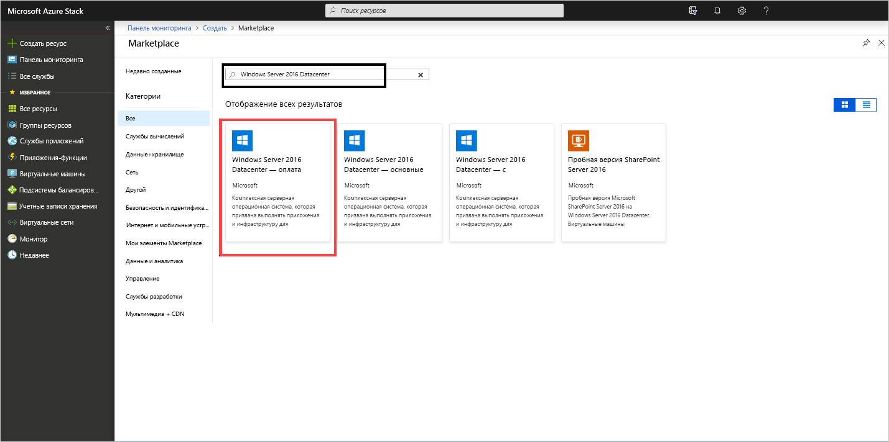
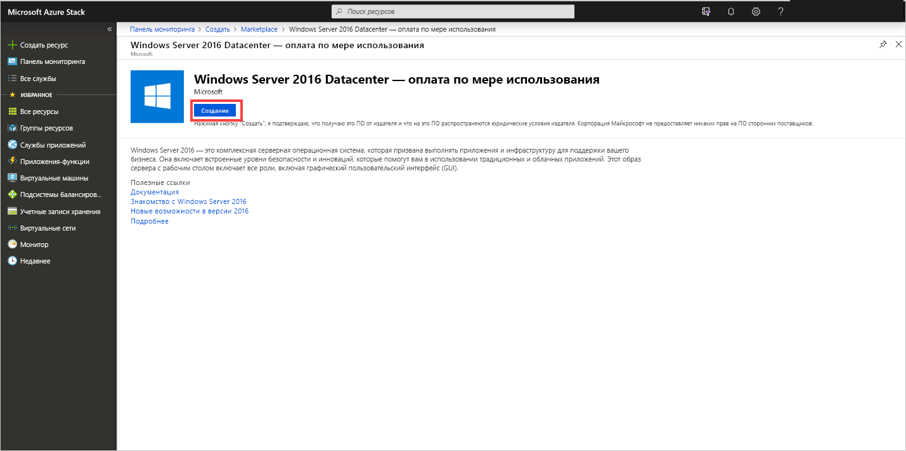
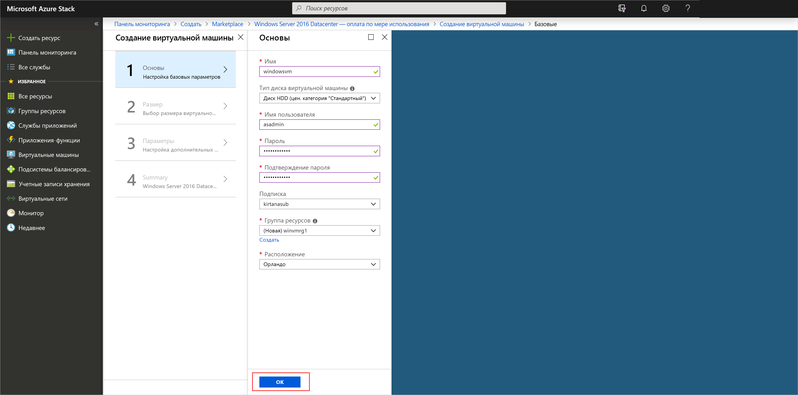
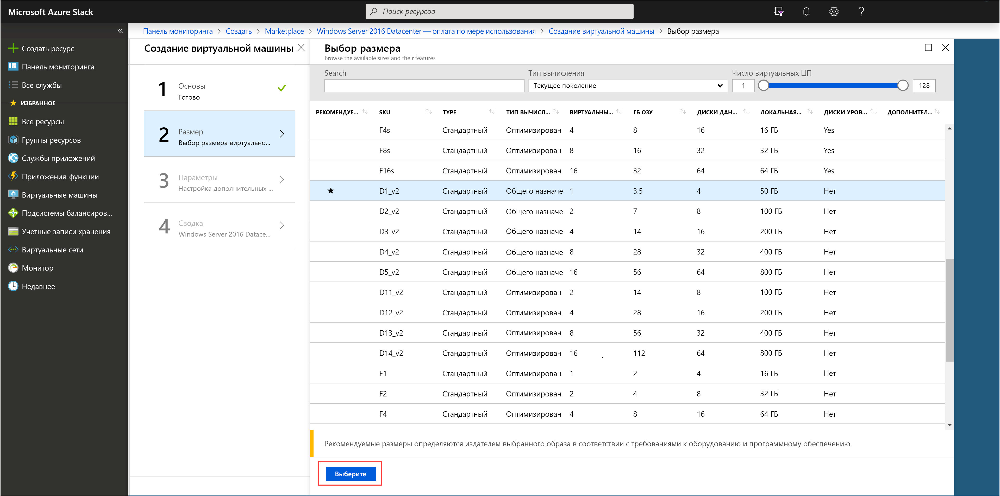
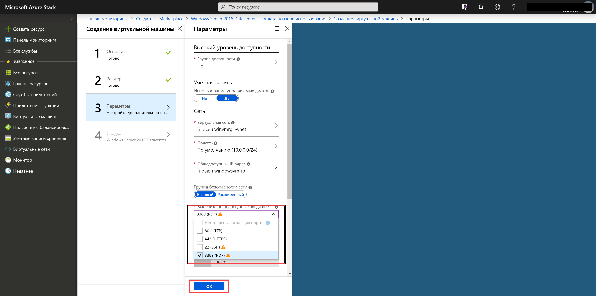
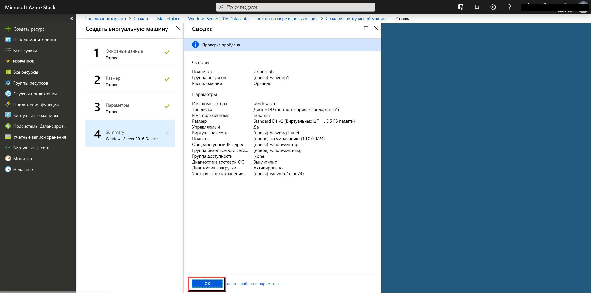
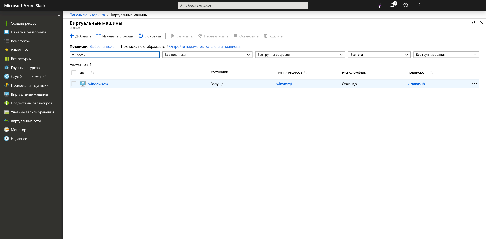

# Краткое руководство. Создание виртуальной машины Windows Server с помощью портала Azure Stack Hub

Узнайте, как создать виртуальную машину Windows Server 2016 с помощью портала Azure Stack Hub.

> [!NOTE]  
> Снимки экрана в этой статье обновлены в соответствии с пользовательским интерфейсом, представленным в Azure Stack Hub версии 1808. В версии 1808 добавлена поддержка *управляемых дисков* помимо неуправляемых дисков. При использовании более ранней версии некоторые экраны (например, при выборе диска) будут отличаться от изображений в этой статье.  

## Войдите на портал Azure Stack Hub.

Войдите на портал Azure Stack Hub. Адрес портала Azure Stack Hub зависит от того, к какому продукту Azure Stack Hub вы подключаетесь.

* Если вам нужен Пакет средств разработки Azure Stack (ASDK), перейдите по адресу https://portal.local.azurestack.external.
* При работе с интегрированной системой Azure Stack Hub используйте URL-адрес, предоставленный оператором Azure Stack Hub.

## Создание виртуальной машины

1. Щелкните **Создать ресурс** > **Вычисление**. Найдите элемент ` Windows Server 2016 Datacenter – Pay as you use`.
    Если вы не видите вариант **Windows Server 2016 Datacenter (оплата по мере использования)** , обратитесь к оператору Azure Stack и попросите его добавить этот образ в Azure Stack Hub Marketplace. Инструкции для оператора облака представлены в статье [Создание и публикация пользовательского элемента Azure Stack Hub Marketplace](../operator/azure-stack-create-and-publish-marketplace-item.md).

    

1. Нажмите кнопку **Создать**.

    

1. Введите **Имя**, **Тип диска**, **Имя пользователя** и **Пароль** в разделе **Основные сведения**. Выберите **подписку**. Создайте **группу ресурсов** или выберите существующую, укажите **Расположение** и щелкните **ОК**.

    

1. В разделе **Размер** выберите **D1_v2**, а затем щелкните **Выбрать**.

    

1. На странице **Параметры** внесите необходимые изменения в значения по умолчанию. Необходимо выбрать общедоступные входящие порты из соответствующего раскрывающегося списка. По завершении нажмите кнопку **ОК**.

    

1. В разделе **Сводка** нажмите кнопку **ОК**, чтобы создать виртуальную машину.

    

1. Чтобы просмотреть новую виртуальную машину, выберите **Виртуальные машины**. Выполните поиск по имени виртуальной машины и выберите ее в результатах поиска.

## Очистка ресурсов

Завершив использование виртуальной машины, удалите ее и вместе со связанными ресурсами. Для этого выберите группу ресурсов на странице виртуальной машины и щелкните **Удалить**.

## Дальнейшие действия

В этом кратком руководстве вы развернули простую виртуальную машину Windows Server. Дополнительные сведения о виртуальных машинах Azure Stack Hub см. в статье [Рекомендации по использованию виртуальных машин в Azure Stack Hub](azure-stack-vm-considerations.md).
